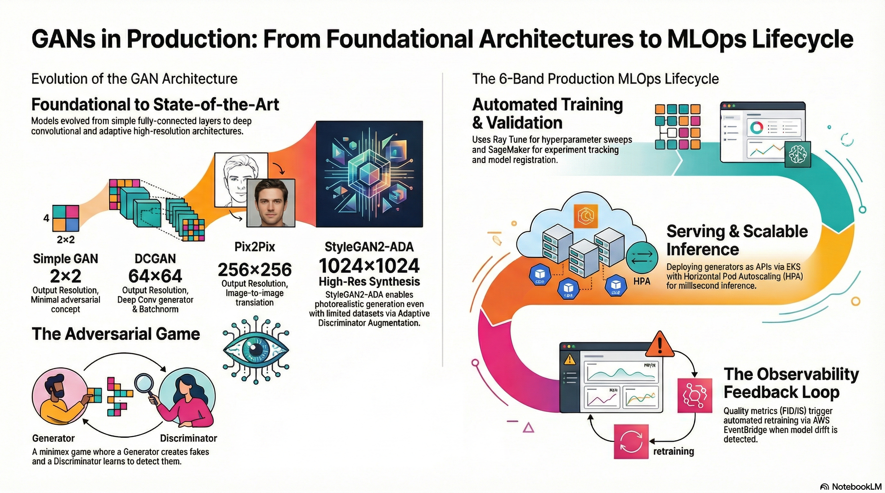
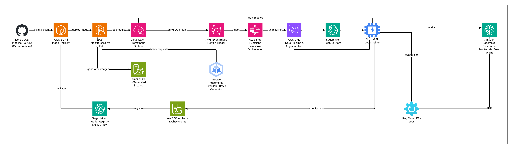

# 🧠 Generative Adversarial Network (GAN) Collection
*A complete journey from simple GANs to advanced architectures for face and text-to-image synthesis.*

---

## 📘 Overview
This repository aggregates multiple **GAN-based projects** implemented using **PyTorch** and **TensorFlow**, showcasing the evolution from foundational adversarial models to advanced architectures such as **DCGAN**, **Pix2Pix**, **StackGAN**, and **StyleGAN2-ADA**.  

Each sub-project includes code, documentation, dataset references, and visuals to help learners and practitioners understand how adversarial training can generate, reconstruct, and manipulate images.

---

---

## Project Index

| # | Project | Architecture | Capability demonstrated | Input → Output |
|---:|---|---|---|---|
| 1 | Slanted Land | **Vanilla GAN** | **Adversarial training mechanics** (instability, collapse, minimax dynamics) | noise → **2×2** binary image |
| 2 | Fake Faces | **DCGAN** | **Convolutional synthesis** (spatial inductive bias, improved stability) | noise → face image |
| 3 | Frontalization | **Pix2Pix (cGAN)** | **Conditional translation** with paired supervision (controlled mapping) | angled face → frontal face |
| 4 | Text-to-Image | **StackGAN Stage-I/II** | **Text conditioning** + staged refinement (layout → detail) | caption embedding → image |
| 5 | High-Res Synthesis | **StyleGAN2 + ADA** | **High-res realism** + **small-data stabilization** (ADA reduces D overfit) | latent → high-res image |

----

## System Design

---

##  References
- Goodfellow et al., *Generative Adversarial Networks*, NeurIPS 2014  
- Radford et al., *DCGAN* (2015)  
- Isola et al., *Pix2Pix* (2017)  
- Zhang et al., *StackGAN* (2017)  
- Karras et al., *StyleGAN2-ADA* (2020)  

**Acknowledgments:**  
Special thanks to the open-source community and dataset providers for enabling experimentation with GAN architectures.
